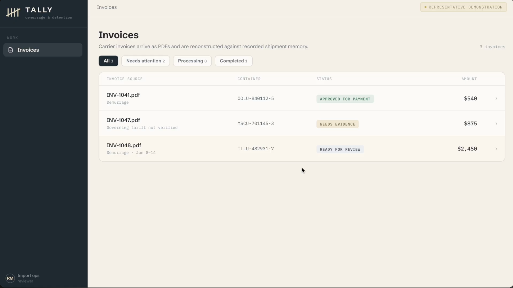
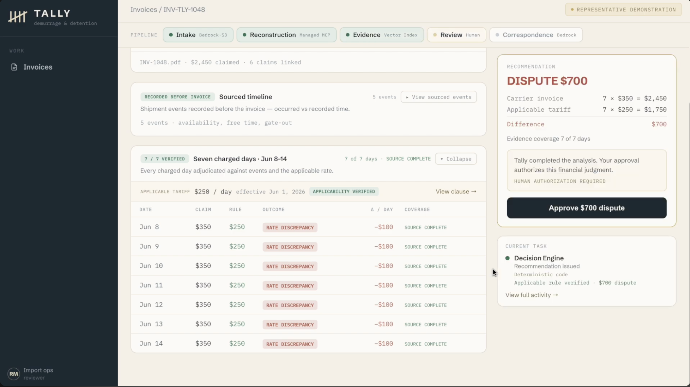
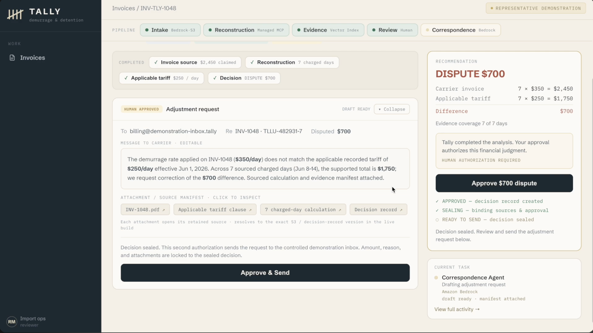

# Tally

Sourced, inspectable demurrage decisions built from shipment memory that was
recorded before the invoice arrived.

**SYNTHETIC DEMO — FICTIONAL DATA.** No real dispute is sent. No carrier was
contacted, no credit was recovered, and no legal determination is claimed. All
names, invoices, tariffs, containers, dates, and amounts are fictional.

Ocean carriers bill demurrage when a container sits past its free time. Judging
one of those invoices means reconstructing what actually happened at the
terminal, finding the tariff that governed it, and checking every charged day —
months after the fact, against a carrier who has the paperwork. Tally records
that evidence as it happens, then proves what was true when the invoice arrives.

## Judge access

The hosted demo URL and sign-in credentials are provided with the Devpost
submission, not here — the deployment is access-controlled and this repository
is public.

Sign-in is Amazon Cognito. The browser holds no credential of its own: the
session is an httpOnly cookie, and every request — pages, API reads, PDF bytes,
the SSE stream — is validated server-side.

## How it works

**Extract.** An operator imports a carrier PDF through the authenticated intake
API. Versioned S3 preserves the exact bytes and returns a `VersionId` that is
stored alongside a SHA-256 in CockroachDB. Amazon Bedrock (Claude Sonnet 4.6)
extracts the carrier's claims, and every extracted value must quote a substring
that can be located verbatim in the source text. A claim whose quote cannot be
found is rejected before any worker sees it — the model may read the document,
but it cannot paraphrase a number into the record.

**Reconstruct.** The reconstruction agent retrieves prior shipment memory
through the CockroachDB Cloud Managed MCP Server: one fixed, read-only
`select_query` against a narrow view, scoped to the container and constrained to
`recorded_at <= knowledge_cutoff`, where the cutoff is the invoice's own arrival.
That constraint is re-checked deterministically in pure Python after retrieval.
Nothing learned after the invoice landed can be used to judge it.

**Adjudicate.** CockroachDB Distributed Vector Indexing retrieves candidate
tariff clauses — Titan Text Embeddings V2, 1024 dimensions, C-SPANN index over
`(tenant_id, carrier_id, embedding)`. Similarity only *ranks* candidates.
Deterministic code then validates each one against effective date, scope,
currency, unit, and exact rate text, and accepts a rule only if exactly one
candidate survives with one distinct rate. No candidate passing means
`NEEDS_EVIDENCE`, not a guess.

**Seal.** A human reviews the sourced case file and authorizes. The approval,
the decision record, the bound evidence references, the status projection, the
durable event, and its outbox row all commit in **one SERIALIZABLE transaction**,
guarded by a row lock, an idempotency key, a version-plus-digest staleness check,
and a unique constraint. A partial seal cannot occur. Correspondence is then
drafted by Bedrock from the sealed record alone, and every number in the
generated prose is checked back against the seal before the draft can be sent.

## The three outcomes

The queue holds three fictional invoices that end in three different states,
because the evidence differs in each case:

| Invoice | Outcome | Why |
|---|---|---|
| INV-1041 | `APPROVED FOR PAYMENT` | the charged rate matches the applicable recorded tariff |
| INV-1047 | `NEEDS EVIDENCE` | no governing tariff was recorded, so Tally refuses to conclude |
| INV-1048 | `DISPUTED $700` | invoiced $350/day against a verified $250/day tariff, across 7 sourced days |

`NEEDS EVIDENCE` is the point, not a gap. Incomplete memory withholds authority
rather than guessing, and that refusal is a persisted state with a named reason —
not a loading spinner.

The hero case is INV-1048: a $2,450 demurrage invoice, seven charged days from
June 8–14, adjudicated at $100/day difference against a tariff clause that was
already in memory before the invoice was issued.

### The queue

Three invoices, three outcomes. Refusal is a first-class result, not an error
state.



### The sourced case file

Every charged day is adjudicated against events recorded before the invoice
arrived and against the tariff clause that governed it. The reviewer sees the
claim, the rule, the outcome, and the per-day difference — with the pipeline
naming the service behind each stage.



### The sealed decision

After a human authorizes, the decision is sealed in one transaction and the
adjustment request is drafted from that sealed record. Every attachment resolves
to the exact retained source version.



## Sponsor tools and services

### CockroachDB

**Managed MCP Server** is the reconstruction read path. The runtime authenticates
with a non-expiring service-account API key (falling back to a leased OAuth
bundle), and the adapter proves the credential is read-only by issuing an
`insert_rows` probe against a random table name and requiring an OAuth
`insufficient_scope` denial. Only `select_query` is exposed to application code.

**Distributed Vector Indexing** is the tariff retrieval path: a real
`VECTOR(1024)` column with a C-SPANN index (`vector_l2_ops`), queried with the
named index forced so the product path is exercised rather than a sequential
scan. Each candidate's clause hash, embedding hash, and source version are
captured at retrieval and bound by digest into the seal.

**One consistency boundary.** Shipment events, reconstruction revisions, charged
day judgments, immutable recommendation versions, human approvals, decision
seals, and the durable event outbox are all CockroachDB rows. The seal commits
across them atomically under SERIALIZABLE isolation, with client-side retry on
SQLSTATE 40001.

### AWS

- **Amazon Bedrock** — Claude Sonnet 4.6 for claim extraction and correspondence
  prose; Titan Text Embeddings V2 for clause retrieval. Models never decide a
  verdict. Every verdict is computed in Python from validated inputs.
- **Amazon S3** — versioned retention of the exact source bytes. A read that
  returns a different `VersionId` than the one bound in the decision raises
  rather than proceeding.
- **Amazon Cognito** — judge authentication. JWTs are validated against the
  pool's live JWKS for signature, issuer, expiry, `token_use`, and app-client
  binding on every request.
- **AWS App Runner** — hosts one same-origin service: the Vite SPA and the
  FastAPI API.
- **SSM Parameter Store** — the CockroachDB DSN, the MCP credential, and the
  Cognito identifiers. No secret is committed to this repository.
- **DynamoDB** — a short-lived conditional lease that serializes OAuth token
  rotation so concurrent workers cannot race each other.

## Architecture

```text
Browser (Cognito session cookie, no embedded credential)
  └── AWS App Runner — one same-origin service
        ├── Vite SPA (ui-next/)
        └── FastAPI (src/platform/)
              ├── intake API ── versioned S3 ── Bedrock extraction
              │                                   └── verbatim anchor firewall
              ├── durable workflow_tasks (leases, bounded retries)
              │     ├── EXTRACT_INVOICE_CLAIMS   Bedrock
              │     ├── START_RECONSTRUCTION     CockroachDB Managed MCP
              │     ├── FIND_APPLICABLE_RULE     Distributed Vector Indexing
              │     └── JUDGE_DAYS               deterministic core
              ├── approve + seal ── ONE SERIALIZABLE TRANSACTION
              └── SSE over durable invoice_events (Last-Event-ID resume)
```

Everything up to the recommendation runs as asynchronous, leased, retryable
workers. Everything from human approval onward is synchronous request-path code
in serializable transactions.

The codebase is hexagonal: `src/core` holds pure functions over Pydantic models
with zero external dependencies, `src/external` holds the adapters, and
`src/platform` holds routes and workers. A layer test enforces the boundary —
`src/core` may not import from either of the others.

## Repository structure

| Path | Contents |
|---|---|
| `src/core/` | pure decision logic — claim anchoring, reconstruction, applicability, judgment, seal manifest |
| `src/external/` | adapters — CockroachDB DAL, Managed MCP client, vector search, Bedrock, S3, Titan |
| `src/platform/` | FastAPI routes, workers, repositories, auth |
| `ui-next/` | the deployed React SPA (the older `ui/` is not shipped) |
| `migrations/` | ordered SQL migrations |
| `tests/` | 898 tests — unit, integration, fallback |
| `scripts/` | operator and demo tooling |
| `contract/` | API contract fixtures |

## Local verification

Prerequisites: Python 3.12, Node.js 20+, npm.

```bash
# Backend: the full suite runs offline. Bedrock, Managed MCP, S3 and Cognito
# all have test doubles, so no AWS account and no network are required.
python3.12 -m venv .venv
.venv/bin/pip install -r requirements.txt -r requirements-dev.txt
.venv/bin/python -m pytest              # 898 tests
.venv/bin/python -m ruff check src/     # shipped runtime is lint-clean

# Frontend: ui-next/ is the deployed SPA.
npm --prefix ui-next ci
npm --prefix ui-next run build
```

The SPA defaults to the live provider and talks to the FastAPI app on the same
origin. Append `?provider=mock` to run the offline demo scene without a backend.

Running the pipeline end to end against a real database additionally requires a
CockroachDB DSN, AWS credentials with Bedrock access, and the migrations in
`migrations/` applied in order. The hosted deployment is the intended path for
evaluating the live system; the test suite covers the decision logic without it.

## Environment

Copy `.env.example` and fill it privately; never commit it.

| Variable | Purpose |
|---|---|
| `TALLY_CRDB_DSN` | CockroachDB connection string |
| `TALLY_TENANT_ID` | tenant scope for the demo lane |
| `TALLY_COGNITO_USER_POOL_ID`, `TALLY_COGNITO_CLIENT_ID` | judge authentication; their presence enables Cognito enforcement |
| `TALLY_JUDGE_AUTH_ENABLED` | switches the app from local static-bearer auth to Cognito |
| `TALLY_MCP_CLUSTER_ID`, `TALLY_MCP_DATABASE` | Managed MCP scope |
| `TALLY_INTAKE_BUCKET`, `TALLY_INTAKE_KEY_PREFIX` | versioned S3 retention target |

## Honest boundaries

Tally is a reproducible demonstration on fictional data. It is not a production
service, and it does not claim to be one.

- **Every carrier, terminal, container, tariff, invoice and amount is
  synthetic.** No carrier is contacted, no invoice is paid, and no money moves.
- **Outbound mail is a demonstration provider.** The send path is real and
  fully gated, and returns a real receipt id, but no email leaves the system.
- **The filmed hero invoice is seeded.** INV-1048's decision chain is seeded to
  a known-good state so the demo is reliable on camera. The pipeline that
  produces it is the real one, and the deployed workers run end to end for
  genuinely imported invoices.
- **The model never decides anything.** Bedrock extracts claims and writes
  correspondence prose. Every verdict, rate, amount, and date is computed
  deterministically in Python from validated inputs, and generated prose is
  checked back against the sealed record before it can be sent.
- **CockroachDB time travel is bounded.** The configured MVCC window is 90 days;
  exact versioned S3 objects provide the longer-lived source binding. Tally does
  not claim indefinite historical replay.
- **One tenant, one judge account.** This is an isolated demonstration lane, not
  a multi-tenant deployment.

## License

Licensed under the [MIT License](LICENSE).
